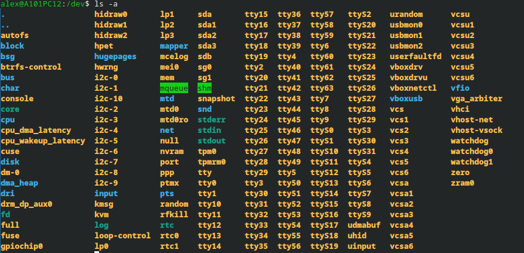

# Implantacion SO
---
22/09
---
### Fundamentos de SO
1. Conceptos Basicos

    Proceso es un programa que ha iniciado su ejecución
    El SO gestiona ejecuciones de procesos en mono o multi programacion
    Hay 2 tipos de procesos 
    Interactivo
    Por lotes: es una cola donde esoerab su turno el so 

    En la **monoprogramacion** se ubica en la memoria principal y no se inicia hasta que finaliza el programa en ejecución, siempre que hay una operación de e/s se hace una llamada al so, al acabar esa operacion se genera una interrupciónn que llama al so de nuevo, la memoria casi siempre queda cupada, desaprovechando memoria, tambien se desaprovecha procesador y perifericos ya que se usan uno a uno
        
    En la **multiprogramacion** clasica, se ejecuta un proceso cuando se bloquea otro proceso, en la mas evolicuonada el so puede interrumpir un proceso 

    Las diferencias principales son, el no tener que esperar a procesos, aprovechan los tiempos muertos del procesador y perifericos, y el espacio no ocupado en la memoria principal, 

    Un proceso nonato es un programa en espera de ejecutarse, un preparado no esta bloqueado y espera ejecucion, el activo es el que esta en funcionamiento, uno bloqueado esta en espera de su turno de nuevo y el concluido es aquel proceso que ya se ha completado

    Linux introduce los threads, que es un proceso capaz de escomponerse en diferentes tareas

    Intercambio de pemoria principal/disco, en un sistema con tiempo compartido 

2. Gestión del procesador

3. Gestión de la memoria

---
23/09
---
### [Video Referencia](https://www.youtube.com/watch?v=V4--MPYajUk)

## Medida de prestaciones 

- Productividad o rendimiento
- Tasa utilización del procesador
- Tiempo procesamiento de cpu
- Tiempo entrada y salida
- Tiempo de espera

## Sistemas Multiprocesamiento

- Asimetrico
- Simetrico

### Planificadores
- Largo plazo
- Mediano plazo
- Corto plazo

## Estrategias Asignación

- No apropiativa 
    - SO No puede interrumpir
- Apropiativa  
    - SO va interrumpiendo

***Video hasta Algoritmos basicos de planificación***

---
08/10
---

## Gestió Entrada/Sortida

### [PDF](https://moodle.iescarlesvallbona.cat/pluginfile.php/289294/mod_resource/content/14/Gestio_ES_1r_ASIX.pdf)

**E/S Procés:** Teclat: Genera senyal -> Controlador: Interpreta dispositiu -> SO: Rep i gestiona -> Aplicació: Rep el caracter

**2 tipus de dispositius**
1. Dispositius de blocs - treballen amb blocs d'info
2. Dispositius de caracters - treballen amb intercanvi sequencial de caracters i bits

## Operació de E/S

- **E/S Programada**
- **Interrupcións**
- **DMA**

### E/S Programada (polling)
- Pregunta continuament al dispositiu si esta preparat, poc eficient
### E/S Interrupcións (canvi de context)
- Fa una interrupció del fluxe de la CPU(SO), la CPU(SO) determina segons la importancia de la tasca que interromp si aturar la operació que esta fent o no, si interromp fa una backup del estat del procés que estaba executant, i una vegada completada la interrupció restaura el procés.
### DMA (Direct Memory Access)
- Es un chip especial, que te 4 registres
    - Quantitat de dades
    - Adreçes de memoria
    - L/E
    - Adreça dispositiu
- El DMA funciona sense la necesitat de la CPU, una vegada programat el chip funciona sol, una vegada finalitzat avisa a la CPU

- *Ex: Agafa **1000 bytes** de **FA32** i **escriu** a **3FFF***

|Mecanisme|CPU|Ús típic|
|:--:|:--:|:--:|
Polling|Molt ocupada|Dispositius senzills / casos específics|
Interrupcions|Intervé quan cal|Teclat, ratolí, molts dispositius
DMA|Poca intervenció durant la còpia|Transferències grans de dades

### Buffer (memoria intermedia)
- El buffer emmagatzema dades mentre el dispositiu o l'aplicació arriba al ritme de l'altre

### Cues d'E/S
- La cua permet ordenar i gestionar les peticions sense perdre-les.

- *Ex: Moltes peticions de molts periferics i s'han d'organitzar d'alguna manera*
### Exemple complet: llegir fitxer de disc
*Aplicació: read() - SO: Gestiona petició - Driver: Parla amb el controlador - Disc: Llegeix els blocs - RAM: Dades arriben a la memoria*

### E/S a Linux: /dev
- Tots els dispositius que tenim els podem veure a /dev

### Main takeaways
- El SO gestiona la comunicació entre apps i dispositius
- Els drivers permeten al SO controlar dispositius concrets
- Les E/S poden gestionar-se amb polling, interrupcions o DMA.
- Els buffers i les cues permeten coordinar ritmes i moltes peticions.
- El spooling és especialment conegut en la gestió d’impressores.
- Linux i Windows tenen models diferents, però els conceptes fonamentals són semblants.