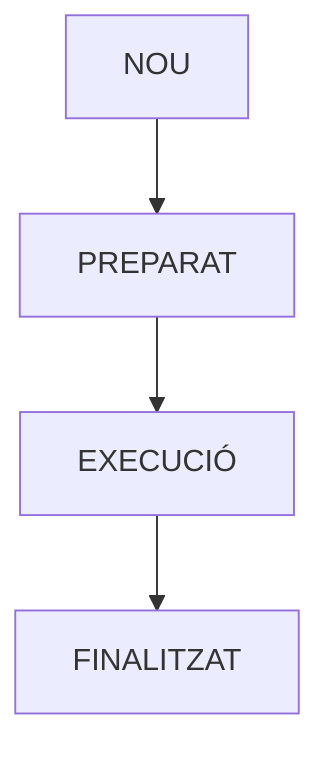
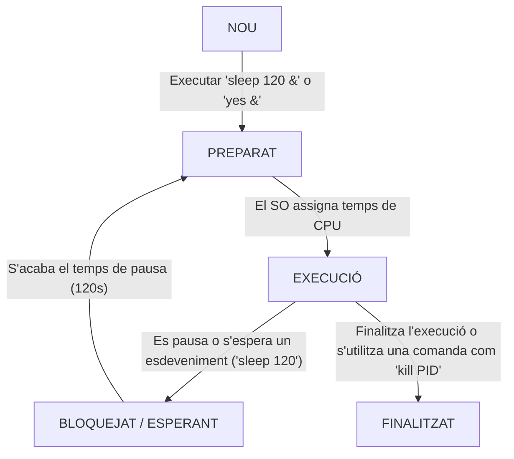

<!-- Aquest codi es necesari només per pasar el markdown a pdf amb les pautes demanades a l'activitat -->

<style>
@page {
  margin: 2.5cm;
  @bottom-right {
    content: counter(page);
    font-size: 10pt;
    font-family: sans-serif;
  }
}

body {
  font-family: Arial, Helvetica, sans-serif;
  font-size: 11pt;
  line-height: 1.5;
}

code {
  color: rgb(234, 128, 0);
  background-color: rgb(40, 40, 40);
  padding: 2px 4px;
  border-radius: 3px;
}

.resposta {
  color: #1a5276;
  font-weight: bold;
}

.portada {
  text-align: center;
  padding-top: 50px;
}

.portada h1 {
  font-size: 24pt;
  margin-bottom: 20px;
}

.portada h2 {
  font-size: 16pt;
  color: #555;
  margin-bottom: 40px;
}

.portada .dades {
  font-size: 12pt;
  margin-top: 150px;
  text-align: left;
  border-left: 4px solid #ea8000;
  padding-left: 15px;
}

h2 {
  page-break-before: always;
}
</style>

<!-- PORTADA -->

<div class="portada">
  <h1>Projecte 1. Gestió de processos d’un sistema operatiu</h1>
  <h3>Implantació de Sistemes Operatius (0369)</h3>

  <div class="dades">
    <p><strong>Cicle Formatiu:</strong> Administració de Sistemes Informàtics en Xarxa, perfil professional Ciberseguretat (ASIX)</p>
    <p><strong>Alumne:</strong> Alex Morcillo Quiñones</p>
    <p><strong>Data:</strong> Setembre 2026</p>
  </div>
</div>

<div style="page-break-after: always;"></div>

<!-- ÍNDEX -->

## **Índex** - **ASIX - 0369 - Implantació Sistemes Operatius – Projecte 1. Gestió de processos d’un sistema operatiu - Alex Morcillo**

- [Activitat 1 – Quins processos s'estan executant?](#activitat-1--quins-processos-sestan-executant)
- [Activitat 2 – Crear un procés](#activitat-2--crear-un-procés)
- [Activitat 3 – Observar un procés](#activitat-3--observar-un-procés)
- [Activitat 4 – Procés que utilitza la CPU](#activitat-4--procés-que-utilitza-la-cpu)
- [Activitat 5 – Crear i finalitzar un Procés](#activitat-5--crear-i-finalitzar-un-procés)
- [Activitat 6 – Procés pare i procés fill](#activitat-6--procés-pare-i-procés-fill)
- [Activitat 7 – Execució concurrent](#activitat-7--execució-concurrent)
- [Activitat 8 – Planificació](#activitat-8--planificació)
- [Activitat 9 – Sincronització](#activitat-9--sincronització)
- [Activitat 10 – Diagrama final](#activitat-10--diagrama-final)
- [Conclusions](#conclusions)

<div style="page-break-after: always;"></div>

<!-- Aquí comença la activitat -->

## **Activitat 1 – Quins processos s'estan executant?**
Executa: ```ps```


I després: ```ps aux```


### **Respon:**

#### a. Què és un procés?
- Un programa en execució amb recursos i espais de memòria propis assignats pel Sistema Operatiu.
#### b. Quina informació apareix sobre cada procés?
- L'usuari, el pid, els recursos que consumeix, i dades més concretes com el temps d'execució, la seva comanda i el temps que triga.
#### c. Què és el PID?
- És l'ID del procés, que és un número únic assignat a cada procés.
#### d. Escull dos processos de la llista i indica el seu PID i el programa que executen.
- PID 1: Executa `/usr/lib/systemd/systemd` (el procés d'inicialització del sistema).
- PID 28: Executa `[kworker/1:0H-kblockd]` (un procés del nucli per a la gestió d'E/S de disc).

## **Activitat 2 – Crear un procés**

Executa: ```sleep 120 &``` després executa  ```ps -p PID -o pid,ppid,state,cmd``` 


### **Respon:**

#### a. Quin PID té el procés?
- El PID que té assignat és 13183.
#### b. Quin PPID té?
- Té el PPID 13148.
#### c. Quin estat presenta?
- L'estat de S o sleep.
#### d. Quin programa està executant?
- Sleep.
#### e. Per què el procés continua apareixent si nosaltres no estem fent res?
- Continua ja que la comanda sleep dorm el procés durant una determinada llargada de temps.

## **Activitat 3 – Observar un procés**

Executa: ```top``` i busca el procés sleep.

### **Respon:** 

#### a. El procés està utilitzant molta CPU?
- No, pràcticament no utilitza CPU (0,0%).
#### b. Quanta memòria utilitza aproximadament?
- No utilitza memòria segons mostra la terminal (0,0%).
#### c. Quin estat apareix?
- En l'estat S o Sleep.
#### d. Què creus que està fent el procés en aquest moment?
- No està fent res ara mateix, adormit a l'espera de futures instruccions.

## **Activitat 4 – Procés que utilitza la CPU**

Executa: ```yes > /dev/null &``` i busca el procés amb: ```top```

### **Respon:**

#### a. Què ha passat amb el consum de CPU?
- Ha pujat al 100%.
#### b. Per què aquest procés consumeix CPU?
- Perquè és una ordre que s'executa de manera infinita fins que es finalitza.
#### c. Compara'l amb el procés ```sleep```.
- Comparat amb el procés de sleep, és tot el contrari: el yes crea respostes contínues i el sleep pausa durant una duració determinada un procés.

*Finalitza el procés amb: ```kill PID``` (32705 en el meu cas)*

## **Activitat 5 – Crear i finalitzar un Procés**

Executa: ```sleep 300 &``` Comprova que existeix: ```ps -p PID``` Ara finalitza'l: ```kill PID``` I torna a executar: ```ps -p PID```


### **Explica:**

#### a. Què ha passat després d'executar kill?
- Que s'ha finalitzat el procés.
#### b. Per què el procés ja no apareix?
- Perquè la comanda kill el finalitza.
#### c. Què significa que un procés estigui finalitzat?
- Que deixa d'estar en execució i allibera la RAM.

## **Activitat 6 – Procés pare i procés fill**

Executa ```bash -c 'sleep 60 & wait'``` Mentre està executant-se, obre una segona terminal i executa: ```ps -ef --forest``` Busca el **bash** i el **sleep**.


### **Respon:** 

#### a. Quin és el PID del bash?
- El PID de bash és 13723.
#### b. Quin és el PID del sleep?
- El PID de sleep és 16754.
#### c. Quin és el PPID del sleep?
- El PPID de sleep és 16753.
#### d. Quin procés és el pare?
- El procés pare és el Bash.
#### e. Quin procés és el fill?
- El procés fill és el Sleep.

### **Fes un esquema utilitzant els PID reals que has obtingut.**

```Taula
/usr/bin/konsole (PID: 13697)  
└── /bin/bash (PID: 13723)  
    └── bash -c sleep 60 & wait (PID: 16753) [PARE]  
        └── sleep 60 (PID: 16754) [FILL]
```

## **Activitat 7 – Execució concurrent**

Obre una terminal i executa aquestes tres ordres: ```sleep 30 &``` , ```sleep 30 &``` i ```sleep 30 &``` Ara executa: ```ps``` 


### **Respon:** 

#### a. Quants processos sleep hi ha?
- Hi ha 3 processos diferents de sleep.
#### b. S'estan executant al mateix temps?
- Sí, ja que al donar la comanda &, pots executar els restants sense esperar que finalitzi la comanda.
#### c. Què significa que els processos s'executin de manera concurrent?
- Vol dir que els tres s'executen alhora.
#### d. Els tres processos tenen el mateix PID?
- No, tenen tres PIDs diferents (19887, 19891 i 19895 en el meu cas).

## **Activitat 8 – Planificació**

Executa: ```yes > /dev/null &``` i dues vegades més: ```yes > /dev/null &``` Obre: ```top``` Observa els tres processos durant uns segons.


### **Respon:**

#### a. Els tres processos reben temps de CPU?
- Sí.
#### b. Tots consumeixen exactament el mateix percentatge de CPU?
- Sí, en el meu cas consumeixen 99.7% de la CPU tots.
#### c. Per què el sistema operatiu ha de decidir quin procés utilitza la CPU?
- En el meu cas cada un està a un nucli diferent per la qual cosa tots tenen la màxima prioritat, però normalment el SO ha de triar per repartir equitativament els recursos del processador i evitar que processos bloqueixin el sistema.
#### d. Què és la planificació de processos?
- És la regla que el SO fa servir per decidir l'ordre i durada que té cada procés a la CPU.

*Finalitza els processos yes amb: ```kill PID1 PID2 PID3```*

## **Activitat 9 – Sincronització**

Crea un fitxer ```touch -f resultat.txt``` Executa: ```for i in {1..100}; do echo A >> resultat.txt; done &``` I al mateix temps: ```for i in {1..100}; do echo B >> resultat.txt; done &``` **Quan acabin**, executa: ```wc -l resultat.txt``` I: ```head -20 resultat.txt```


### **Respon:** 

#### a. Quantes línies esperaves trobar?
- 200 ja que la comanda ```for i in {1..100}``` juntament amb l'```echo...``` demana 100 "A" i 100 "B" al txt.
#### b. Quantes línies hi ha realment?
- 200 línies.
#### c. Apareixen les A i les B agrupades o barrejades?
- Totes les A primer i les B després, en el meu cas, però si executes les dues comandes alhora sortirien barrejades intercalant A i B.
#### d. Per què dos processos poden interferir quan treballen sobre un mateix recurs?
- Perquè s'executen a la vegada i sense establir prioritats a l'un o l'altre.
#### e. Què és la sincronització de processos?
- És la coordinació de processos que fa el SO quan s'executen al mateix temps per tal que comparteixin dades i recursos sense generar errors.

## **Activitat 10 – Diagrama final**

A partir de les activitats realitzades, crea un diagrama propi que representi el cicle de vida d'un procés.
Ha d'incloure:


i també l'estat: BLOQUEJAT / ESPERANT
Al costat de cada canvi, indica un exemple que hagis observat durant les activitats.



## **Conclusions**

Escriu aproximadament mitja pàgina explicant què has après.
No cal definir tots els conceptes.
Has de respondre amb les teves paraules:
  1. Què és un procés? 
  2. Quina funció té el PID? 
  3. Quins estats pot tenir un procés? 
  4. Per què el sistema operatiu necessita planificar els processos? 
  5. Què significa que diversos processos s'executin concurrentment? 
  6. Per què és necessària la sincronització?

Un procés és una tasca en execució que consumeix recursos del sistema. El PID ajuda a identificar cada procés mitjançant una identificació única que es manté durant totes les seves etapes: la creació, l'espera per a l'execució, l'execució mateixa, l'espera o suspensió si es requereix i, finalment, la finalització. El sistema operatiu necessita planificar els recursos per fer funcionar els processos concurrents, ja que aquests s'executen de manera simultània. Això crea la necessitat de gestionar els recursos perquè tot funcioni de manera organitzada, evitant que processos diferents utilitzin els mateixos recursos al mateix temps, la qual cosa generaria errors. Per aquest motiu és tan important la sincronització, ja que sense ella molts processos concurrents acabarien corruptes o funcionant malament. A més d'això, aquesta activitat és útil per acostumar-se a la consola i familiaritzar l'usuari amb les ordres més comunes i bàsiques (```top``` per veure els processos que més consumeixen, ```ps``` per veure els processos actius). També permet entendre a fons com funciona un procés, la relació amb els seus processos pare i tot allò que hi ha involucrat dins del sistema operatiu per fer funcionar sense errors accions tan "bàsiques" com executar una ordre, crear un directori o editar un fitxer, les quals tenen molta més complexitat de la que un mateix es podria imaginar en un principi.


*Ús de la IA(Gemini):En aquesta activitat he utilitzat la IA únicament per corregir errors ortogràfics, i d'estructura del markdown, juntament amb el corrector de [Softcatalà](https://www.softcatala.org/corrector/) per a la conclusió final, li he passat l'arxiu .md (markdown) sense les preguntes i li he demanat que em digui totes les faltes d'ortografia.*

