<!-- Aquest codi es necesari només per pasar el markdown a pdf amb les pautes demanades a l'activitat -->

<style>
@page {
  margin: 2.5cm;
  @bottom-right {
    content: counter(page);
    font-size: 10pt;
    font-family: sans-serif;
  }
}

body {
  font-family: Arial, Helvetica, sans-serif;
  font-size: 11pt;
  line-height: 1.5;
}

code {
  color: rgb(234, 128, 0);
  background-color: rgb(40, 40, 40);
  padding: 2px 4px;
  border-radius: 3px;
}

.resposta {
  color: #1a5276;
  font-weight: bold;
}

.portada {
  text-align: center;
  padding-top: 50px;
}

.portada h1 {
  font-size: 24pt;
  margin-bottom: 20px;
}

.portada h2 {
  font-size: 16pt;
  color: #555;
  margin-bottom: 40px;
}

.portada .dades {
  font-size: 12pt;
  margin-top: 150px;
  text-align: left;
  border-left: 4px solid #ea8000;
  padding-left: 15px;
}

h2 {
  page-break-before: always;
}

.index-personalitzat {
  font-size: 14pt;
  line-height: 2;
}

.nota {
  font-size: 8pt;
  color: rgb(40, 40, 40);
}
</style>

<!-- PORTADA -->

<div class="portada">
  <h1>Projecte 2. Gestió de memoria d’un SO</h1>
  <h3>Implantació de Sistemes Operatius (0369)</h3>

  <div class="dades">
    <p><strong>Cicle Formatiu:</strong> Administració de Sistemes Informàtics en Xarxa, perfil professional Ciberseguretat (ASIX)</p>
    <p><strong>Alumne:</strong> Alex Morcillo Quiñones</p>
    <p><strong>Data:</strong> Octubre 2026</p>
  </div>
</div>

<div style="page-break-after: always;"></div>

<!-- ÍNDEX -->

## **Índex** - **ASIX - 0369 - Implantació Sistemes Operatius – Projecte 2. Gestió de memòria d’un SO - Alex Morcillo**

<div class="index-personalitzat">

- [ACTIVITAT 1 · Fotografia inicial del sistema](#activitat-1--fotografia-inicial-del-sistema)
- [ACTIVITAT 2 · Quins programes utilitzen la memòria?](#activitat-2--quins-programes-utilitzen-la-memòria)
- [ACTIVITAT 3 · Què passa quan obrim programes?](#activitat-3--què-passa-quan-obrim-programes)
- [ACTIVITAT 4 · Investiguem un procés](#activitat-4--investiguem-un-procés)
- [ACTIVITAT 5 · Paginació](#activitat-5--paginació)
- [ACTIVITAT 6 · Memòria virtual](#activitat-6--memòria-virtual)
- [ACTIVITAT 7 · Abans i després](#activitat-7--abans-i-després)
- [ACTIVITAT 8 · Particions, segmentació i paginació](#activitat-8--particions-segmentació-i-paginació)
- [ACTIVITAT 9 · Investigació final](#activitat-9--investigació-final)
- [Conclusions](#conclusions)

</div>

<div style="page-break-after: always;"></div>

<!-- Aquí comença la activitat -->

## **ACTIVITAT 1 · Fotografia inicial del sistema**

Executa: ```free -h``` i: ```cat /proc/meminfo```
Has d'obtenir:
- memòria RAM total; 
- memòria utilitzada; 
- memòria disponible; 
- memòria lliure; 
- memòria de swap, si n'hi ha. 

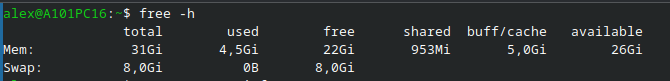

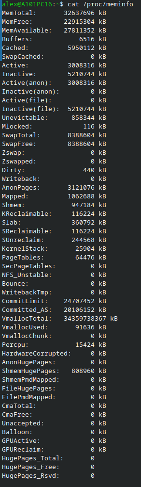

### Respon:
#### a. Quanta RAM té el teu ordinador? 
- Té 32637696 kB, que són uns 32GB
#### b. Quanta memòria està disponible? 
- Té 22915304 kB que equival a uns 22GB
#### c. El teu ordinador utilitza swap? 
- Sí, utilitza Swap
#### d. Quina diferència hi ha entre RAM i swap?
- La RAM és la memòria física instal·lada al sistema i la swap és una reserva que agafa l'ordinador del disc dur en cas d'esgotar tota la memòria RAM

## **ACTIVITAT 2 · Quins programes utilitzen la memòria?**

Executa: ```top``` Ordena els processos per consum de memòria. Selecciona 5 processos diferents. Per cadascun, anota:Procés, PID, %MEM, RES, VIRT

|Procés|PID|%MEM|RES|VIRT|
|:---:|:---:|:---:|:---:|:---:|
|code|7625|1.4%|457356|1452.4g|
|systemd|1|0.1%|21240|39328|
|firefox|4366|2%|657776|11.9g|
|mysqld|3317|0.3%|92724|8194.5g|
|top|9585|0%|6360|235880|

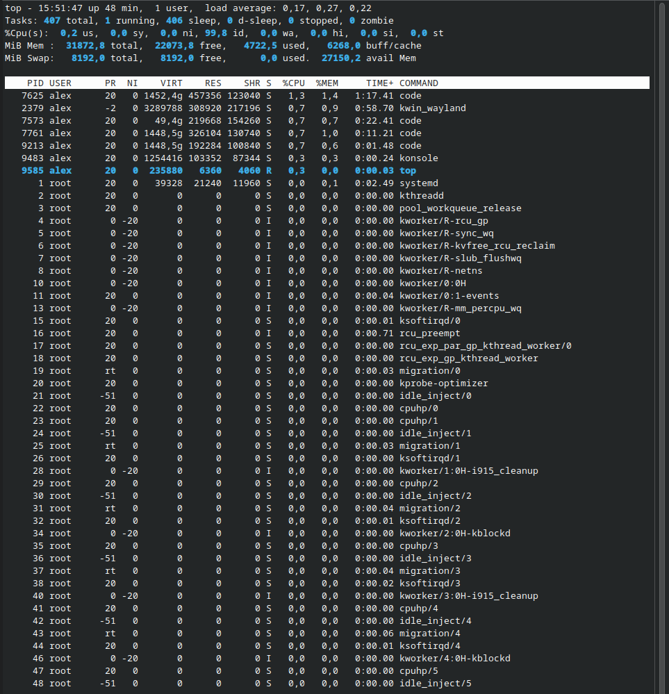

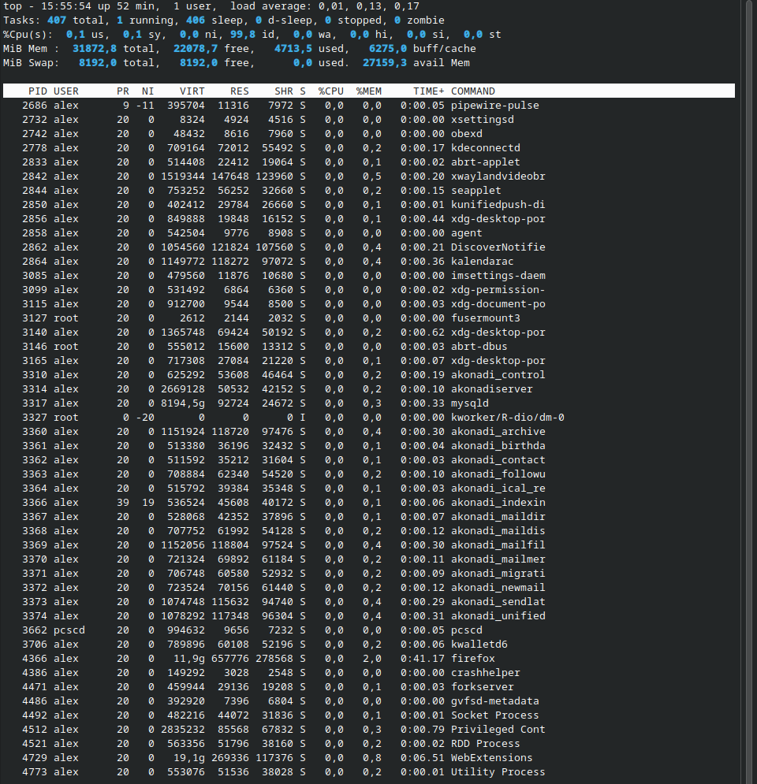

### Investiga: 
Per a cada procés explica breument què és i per a què serveix.
#### Procés 1 (code)
- És l'editor de codi de Microsoft (Visual Studio Code). Serveix per escriure, editar i depurar codi font.
#### Procés 2 (systemd)
- És el daemon principal dels sistemes Linux (PID 1). Serveix per inicialitzar el sistema i gestionar la resta de serveis i processos.
#### Procés 3 (firefox)
- És un navegador web multiplataforma de codi obert. Serveix per accedir a pàgines web i navegar per Internet.
#### Procés 4 (mysqld)
- És el servidor de bases de dades relacionals MySQL o MariaDB. Serveix per emmagatzemar, organitzar i recuperar grans volums de dades.
#### Procés 5 (top)
- És una eina de monitoratge del sistema en mode text. Serveix per veure en temps real l'ús de CPU, memòria i els processos actius.

## **ACTIVITAT 3 · Què passa quan obrim programes?**

Comença amb: ```free -h``` Anota els valors. Ara obre un navegador web i carrega 3 pàgines diferents. Torna a executar: ```free -h``` Anota els valors. Després obre un segon programa (per exemple, LibreOffice Writer). Torna a executar: ```free -h``` Finalment, tanca els programes i torna a executar: ```free -h```


Completa:
|Situació|Memòria disponible|Memòria utilitzada|
|:---:|:---:|:---:|
|**Abans d'obrir programes**|22GB|3.7GB|
|**Navegador obert**|22GB|4.3GB|
|**Navegador + Writer**|21GB|4.3GB|
|**Programes tancats**|22GB|3.6GB|

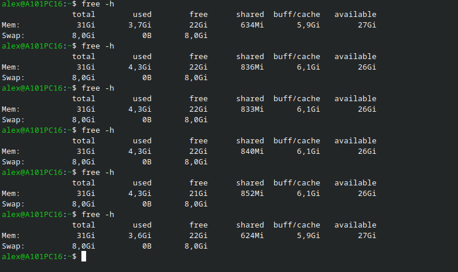

<div class="nota">

*Totes les captures son amb VSCode i Terminal oberts + ho afegit per columna, navegador i navegador + writer he executat la comanda dues vegades*

</div>

### **Explica:**

#### Què ha canviat?
- A mesura que s'obren nous processos es genera més consum de RAM
#### La memòria ha tornat exactament al mateix valor?
- Sí, una vegada tot tancat de nou ha retornat a pràcticament la mateixa RAM
#### Per què creus que passa?
- Perquè cada procés utilitza RAM però pot utilitzar més o menys segons el que està fent en un moment indicat

## **ACTIVITAT 4 · Investiguem un procés**

Escull un dels processos que hagis identificat a l'activitat 2.
Executa: ```ps -p PID -o pid,ppid,cmd,%mem,rss,vsz```
*Substitueix PID pel PID real.*
Després: ```pmap PID```

### **Respon:**

#### Quin procés has escollit? 
- `[kworker/11:0-mm_percpu_wq]` (un fil de treball del nucli de Linux).
#### Quin PID té? 
- 11904
#### Quin PPID té? 
- 2
#### Quanta memòria resident utilitza? 
- 0
#### Quina memòria virtual té? 
- 0
#### Quina informació proporciona pmap?
- Proporciona el mapa de memòria i l'estructura

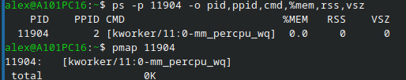

### **ACTIVITAT 5 · Paginació**

Executa: ```getconf PAGE_SIZE```

### **Respon:**

#### Quina mida té una pàgina de memòria en el teu sistema? 
- 4096 bytes
#### Què és una pàgina? 
- Es la unitat mínima de blocs de dades que utilitza el SO per gestionar i transferir dades entre la RAM i l'emmagatzematge intern
#### Per què els sistemes operatius divideixen la memòria en pàgines? 
- Per diverses raons, les principals són l'ús de memòria virtual, l'eficiència i la protecció de la memòria
#### Quina relació hi ha entre les pàgines i la memòria virtual? 
- El SO utilitza la memòria virtual per emmagatzemar les pàgines que no estan en ús i així allibera espai

### **Petit càlcul**

Suposa que un programa necessita 1 MB de memòria.
Calcula aproximadament quantes pàgines necessita el programa utilitzant la mida de pàgina del teu sistema.
Mostra els càlculs.

(*Megabyte a Byte, en sistema binari*) 1 MB = 1024 KB = 1.048.576 Bytes.
(*4096B a MB*) 1.048.576B / 4096B = 256.
Per tant, necessitem exactament 256 pàgines completes de memòria.

## **ACTIVITAT 6 · Memòria virtual**

Executa: ```free -h``` i: ```swapon --show```

### **Respon:**

#### El teu sistema disposa de swap? 
- Sí
#### Quina capacitat té? 
- Té una capacitat de 8 GB
#### Quina diferència hi ha entre RAM i swap?
- La RAM és la memòria física instal·lada al sistema i a swap és una reserva que agafa l'ordinador del disc dur en cas d'esgotar tota la memòria RAM
#### Per què un sistema operatiu pot utilitzar la memòria virtual? 
- Per poder optimitzar l'ús de la RAM, utilitza la virtual per emmagatzemar temporalment els processos que no estan en ús i així deixa espai a la RAM pels processos actius

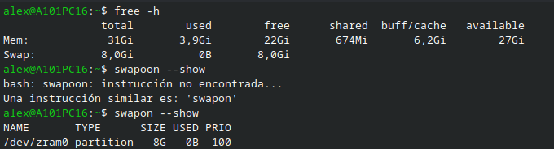

*Important: No cal provocar una situació de falta de memòria. L'objectiu és observar la configuració real del teu sistema.*

<!-- A partir d'aqui he utilitzat un ordinador amb components diferents -->

### **ACTIVITAT 7 · Abans i després**

*Ara realitzaràs una petita investigació. Escull un programa que utilitzis habitualment.*
*Per exemple:*
- *navegador;*
-  *LibreOffice;*
-  *reproductor multimèdia;*
-  *editor de codi.*

<div class="nota">

*Jo he triat el firefox amb un video de youtube obert*

</div>

Fes aquesta seqüència:
1. Comprova la memòria abans d'obrir-lo. ```free -h```
2. Obre el programa.
3. Busca el procés amb: ```top```
4. Anota el seu consum de memòria.
5. Utilitza el programa durant 5 minuts.
6. Torna a comprovar-ne el consum.
7. Tanca el programa.
8. Torna a executar: ```free -h```

|Moment|Memòria disponible|Memòria del programa|
|:---:|:---:|:---:|
|**Abans d'obrir-lo**|23GB|3.6GB|
|**Just després d'obrir-lo**|22GB|4.3GB|
|**Després de 5 minuts**|21GB|4.3GB|
|**Després de tancar-lo**|23GB|3.5GB|


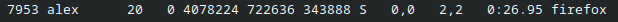

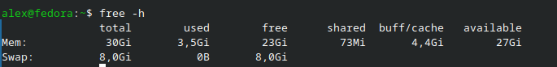

<div class="nota">

*Totes les dades son amb VSCode i Terminal oberts + el prograrma triat*

</div>

### **Explica:**

#### Què ha passat amb la memòria durant l'experiment?
- Durant l'experiment la memòria ha sigut utilitzada per el procés i ha deixat menys memòria lliure, en el meu cas al ser un procés que no descansa i per tant ha seguit consumint, però puc imaginar que si ho fas amb alguna cosa com el LibreOffice al estar "adormit", als pocs minuts el passa a la memòria virtual per lliurar recursos

## **ACTIVITAT 8 · Particions, segmentació i paginació**
*Aquesta part és més teòrica, però hauràs de relacionar-la amb el que has observat*

### **Explica amb les teves paraules:**

#### Particions | Què significa dividir la memòria en particions?
- Les particions creen diferents seccions a la memòria RAM i reserva cada partició per un programa diferent
#### Segmentació | Què significa dividir l'espai d'adreces en segments?
- La segmentació divideix la RAM en blocs de mida basada en la seva funció
#### Paginació | Què significa dividir la memòria en pàgines?
- La paginació divideix la memòria en petits blocs de mida fixa i única
#### Comparació | Completa:
|Tècnica	| Com divideix la memòria? | Avantatge | Inconvenient|
|:---:|:---:|:---:|:---:|
|**Particions**|Particions totals|Senzilla de gestionar i implantar|Queda memòria buida si el programa no ocupa el total assignat|
|**Segmentació**|Divideix segons la funció|És fàcil d'interpretar|Genera fragmentació externa perdent espai total|
|**Paginació**|Molts blocs petits idèntics|No genera fragmentació externa|És molt menys òptima i per tant genera més sobrecàrrega|

<!-- He instalat htop per la facilitat visual, sempre que es demani la comanda ```top``` jo introduiré ```htop```, es el mateix pero amb millor interficie -->

## **ACTIVITAT 9 · Investigació final**

*Escull un procés diferent del de l'activitat 7.*

### **Investiga'l utilitzant: ```ps```, ```pmap PID``` i ```cat /proc/PID/status```**

Selecciona 5 dades diferents que consideris interessants.

*Per exemple:*
    *• memòria;*
    *• PID;*
    *• PPID;*
    *• nombre de fils;*
    *• estat;*
    *• memòria virtual;*
    *• memòria resident.*

### **Crea una fitxa del procés**

**Nom del procés:** Code

**PID:** 20847

**PPID:** 2445

|Dada|Valor|Què significa?|
|:---:|:---:|:---:|
|Estat|Sleeping|Que està inactiu|
|FDSize|1024|Que té reservats 1024 descriptors|
|RssAnon|74752kB|Quantitat de memòria anònima utilitzada pel procés|
|VmData|981104kB|El total de memòria virtual utilitzada|
|SigCgt|1418046ff|Indica al SO quines senyals de software tenen un controlador personalitzat|

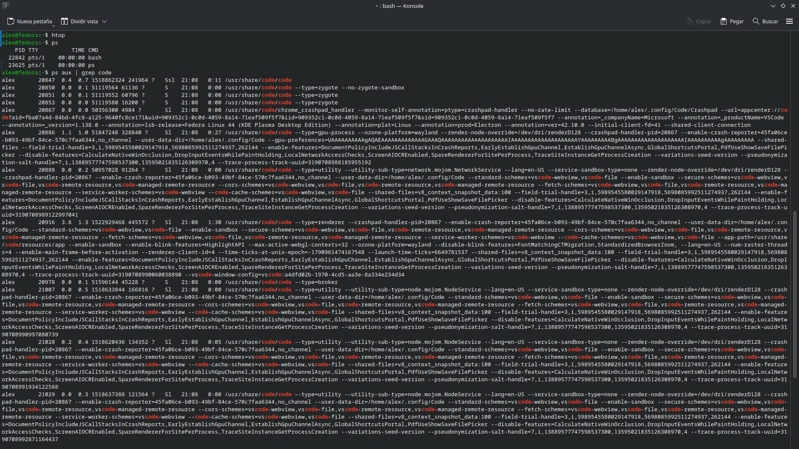

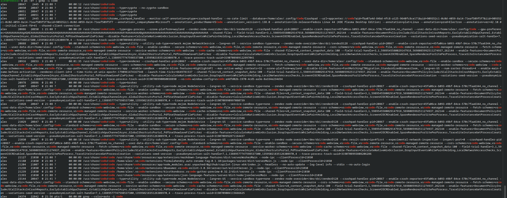

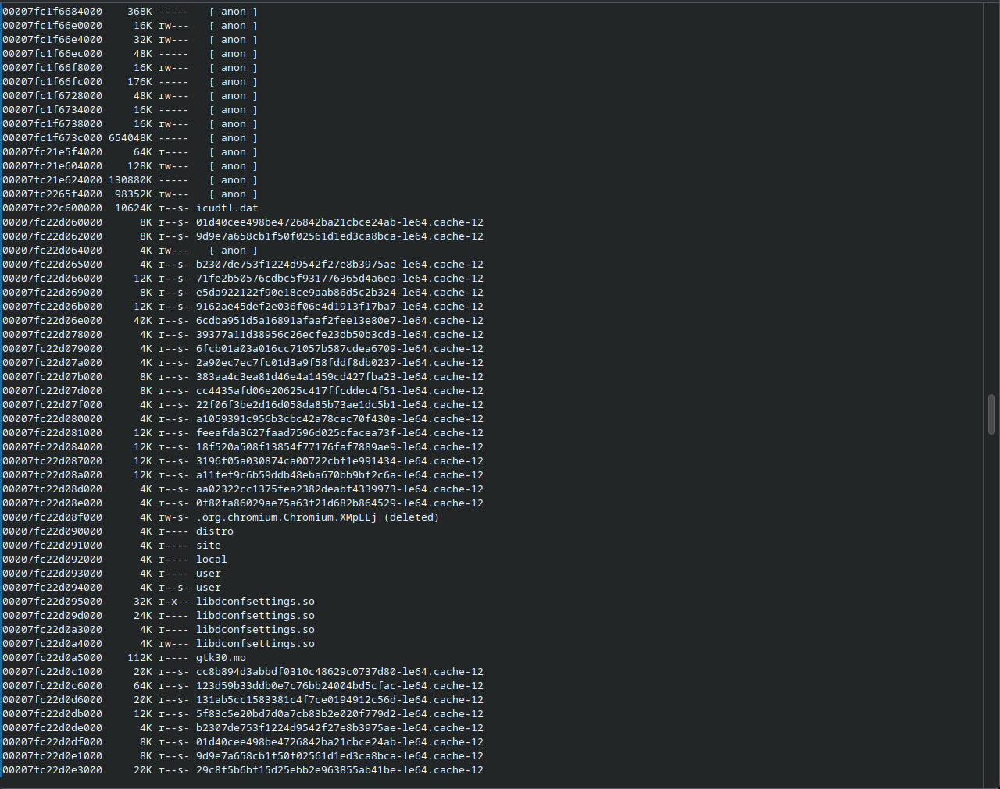

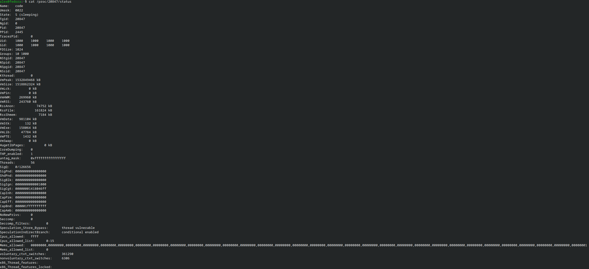

## **Conclusions**
Redacta una conclusió d'aproximadament una pàgina.
Has d'explicar què has descobert durant les proves.
Com a mínim comenta:
  - Com gestiona la memòria el teu sistema; 
  - Quins programes consumeixen més memòria; 
  - Què passa quan obres i tanques aplicacions; 
  - Què és la memòria virtual; 
  - Què és la paginació; 
  - Quina diferència hi ha entre particions, segmentació i paginació; 
  - Quina prova t'ha resultat més interessant.

El meu sistema operatiu gestiona la memòria de moltes formes, però principalment utilitza la memòria RAM, la memòria virtual i la paginació. Usualment, els programes que més memòria consumeixen són aquells que gestionen moltes dades al mateix temps (com els navegadors o els editors de codi). A l'obrir una aplicació, el SO crea un nou espai d'adreçament assignat a les diferents seccions de memòria, i en tancar-la, el SO destrueix el procés i allibera totes les pàgines de memòria assignades perquè puguin ser reaprofitades.

La memòria virtual és el recurs que utilitza el SO per simular tenir més RAM de la que té físicament. Si un procés està inactiu o "adormit" durant prou temps, per tal d'alliberar la memòria RAM (que és molt més ràpida), el SO guarda les seves dades de manera temporal al disc (en l'espai d'intercanvi o swap). A més, per gestionar aquesta memòria s'utilitza la paginació, una tècnica on el SO divideix la memòria virtual en blocs de mida fixa anomenats pàgines, i la RAM en blocs idèntics anomenats marcs. 

Les principals diferències que podem trobar entre particions, segmentació i paginació son en la manera de dividir la memòria. Les particions creen blocs grans adaptats al procés, la segmentació fa blocs de mida variable basant-se en la lògica del programa i la paginació, com ja he comentat, crea blocs d'una mida fixa sense tenir en compte la lògica. En quant a la fragmentació, les particions generen moltíssima fragmentació (interna si la partició és fixa, i externa si és dinàmica), la segmentació té problemes de fragmentació externa, i la paginació no genera pràcticament cap fragmentació, tot i que té l'inconvenient de requerir més recursos de gestió i pot generar sobrecàrrega.

La prova que més interès m'ha generat ha estat la 9, ja que t'impulsa a xafardejar i indagar en totes les dades d'un procés. Això és una cosa que m'agrada molt. El fet d'aprendre realment el significat de cada valor fa que sigui una activitat molt interactiva. A nivell personal, com que soc una persona a qui li agrada molt entendre bé les coses i optimitzar-ho tot, de manera indirecta he acabat descobrint eines noves que no formaven part de l'activitat, com l'ordre ```htop```, que és una versió molt més visual i moderna de l'ordre ```top```. També he après com el sistema utilitza trucs per mantenir-se òptim, ja sigui fent ús de la memòria virtual o enviant processos a dormir quan no són necessaris.
<div class="nota">

*Ús de la IA(Gemini): En aquesta activitat he utilitzat la IA únicament per corregir errors ortogràfics, i d'estructura del markdown, juntament amb el corrector de [Softcatalà](https://www.softcatala.org/corrector/) per a la conclusió final, li he passat l'arxiu .md (markdown) sense les preguntes i li he demanat que em digui totes les faltes d'ortografia.*

</div>