<!-- Aquest codi es necesari només per pasar el markdown a pdf amb les pautes demanades a l'activitat -->

<style>
@page {
  margin: 2.5cm;
  @bottom-right {
    content: counter(page);
    font-size: 10pt;
    font-family: sans-serif;
  }
}

body {
  font-family: Arial, Helvetica, sans-serif;
  font-size: 11pt;
  line-height: 1.5;
}

code {
  color: rgb(234, 128, 0);
  background-color: rgb(40, 40, 40);
  padding: 2px 4px;
  border-radius: 3px;
}

.resposta {
  color: #1a5276;
  font-weight: bold;
}

.portada {
  text-align: center;
  padding-top: 50px;
}

.portada h1 {
  font-size: 24pt;
  margin-bottom: 20px;
}

.portada h2 {
  font-size: 16pt;
  color: #555;
  margin-bottom: 40px;
}

.portada .dades {
  font-size: 12pt;
  margin-top: 150px;
  text-align: left;
  border-left: 4px solid #ea8000;
  padding-left: 15px;
}

h2 {
  page-break-before: always;
}

.index-personalitzat {
  font-size: 14pt;
  line-height: 2;
}

.nota {
  font-size: 8pt;
  color: rgb(40, 40, 40);
}
</style>

<!-- PORTADA -->

<div class="portada">
  <h1>Projecte 3. Gestió d’arxius i E/S en un SO
Gestió de fitxers i E/S en Linux</h1>
  <h3>Implantació de Sistemes Operatius (0369)</h3>

  <div class="dades">
    <p><strong>Cicle Formatiu:</strong> Administració de Sistemes Informàtics en Xarxa, perfil professional Ciberseguretat (ASIX)</p>
    <p><strong>Alumne:</strong> Alex Morcillo Quiñones</p>
    <p><strong>Data:</strong> Octubre 2026</p>
  </div>
</div>

<div style="page-break-after: always;"></div>

<!-- ÍNDEX -->

## **Índex** - **ASIX - 0369 - Implantació Sistemes Operatius – Projecte 3. Gestió d’arxius i E/S en un SO Gestió de fitxers i E/S en Linux - Alex Morcillo**

<div class="index-personalitzat">

- [ACTIVITAT 1 · Fotografia inicial del sistema](#activitat-1--fotografia-inicial-del-sistema)
- [ACTIVITAT 2 · Quins programes utilitzen la memòria?](#activitat-2--quins-programes-utilitzen-la-memòria)
- [ACTIVITAT 3 · Què passa quan obrim programes?](#activitat-3--què-passa-quan-obrim-programes)
- [ACTIVITAT 4 · Investiguem un procés](#activitat-4--investiguem-un-procés)
- [ACTIVITAT 5 · Paginació](#activitat-5--paginació)
- [ACTIVITAT 6 · Memòria virtual](#activitat-6--memòria-virtual)
- [ACTIVITAT 7 · Abans i després](#activitat-7--abans-i-després)
- [ACTIVITAT 8 · Particions, segmentació i paginació](#activitat-8--particions-segmentació-i-paginació)
- [ACTIVITAT 9 · Investigació final](#activitat-9--investigació-final)
- [Conclusions](#conclusions)

</div>

<div style="page-break-after: always;"></div>

<!-- Aquí comença la activitat -->

## **Activitat 1 – On sóc?**

Obre una terminal. Escriu: ```pwd```

#### Què fa aquesta comanda?
- La comanda pwd ens indica en quin directori estem treballant.
### **Tasca**
#### Executa la comanda.
#### Fes una captura de pantalla. 

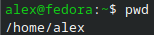

#### Escriu:
- El resultat de pwd indica que estic al directori: de /home/alex

## **Activitat 2 – Què hi ha al directori?**

Executa: ```ls``` Ara executa: ```ls -l``` 
La comanda ls ens permet veure els fitxers i directoris que hi ha en un lloc.
L'opció -l mostra informació addicional.

### **Respon**
#### Quina diferència observes entre ls i ls -l?
- ```ls``` llista els directoris, i ```ls -l``` fa una llista detallada dels directoris amb info extra
### Quants elements apareixen amb ls?
- 11 elements a la meva carpeta de home

Fes una captura de pantalla on es vegin les dues comandes.
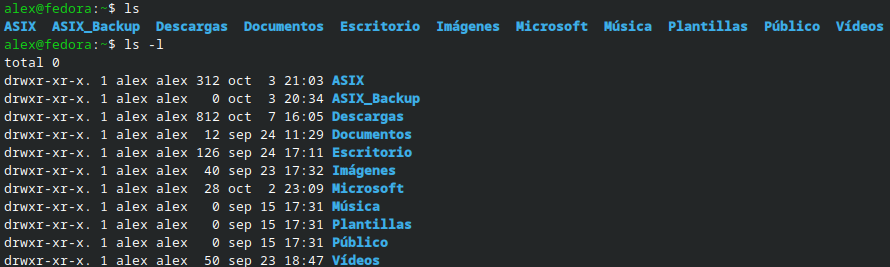

## **Activitat 3 – Crear un directori**

Ara crearàs una carpeta per fer les proves del projecte. Executa: ```mkdir proves_projecte_3``` 
La comanda mkdir serveix per crear un directori.
Comprova que s'ha creat: ```ls```
Ara entra al directori: ```cd proves_projecte_3```
I comprova on ets: ```pwd```

### **Respon:**

#### Què fa mkdir?
- ```mkdir``` crea un directori **M**a**K**e**DIR**ectory
#### Què fa cd?
- ```cd``` cambia de directori a la ruta que li demanis **C**hange**D**irectory

Fes una captura de pantalla del resultat.
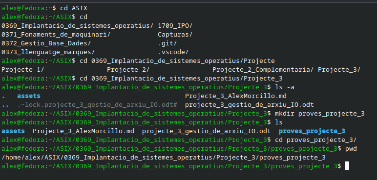

## **Activitat 4 – Crear un fitxer**
Ara crearàs el teu primer fitxer.  
Executa: ```touch document.txt```  
La comanda touch permet crear un fitxer buit.  
Comprova que existeix: ```ls```  
Ara escriu informació dins del fitxer: ```echo "Aquest és el meu primer fitxer Linux" > document.txt```  
Per veure el contingut: ```cat document.txt```  

### **Respon:**
#### Quin nom té el fitxer?
- document
#### Quin text conté?
- Aquest és el meu primer fitxer Linux
#### Per a què serveix cat?
- ```cat``` s'utilitza per llegir els continguts del fitxer indicat
Fes una captura on es vegi el fitxer i el seu contingut.
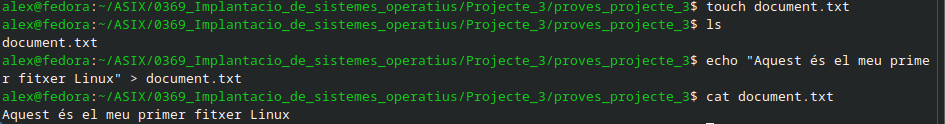

## **Activitat 5 – Afegir informació**

Ara afegirem una segona línia al fitxer.
Executa: ```echo "Estic aprenent a utilitzar Linux" >> document.txt```
I comprova el resultat: ```cat document.txt```

### **Observa**
Abans havíem utilitzat: ```>``` Ara hem utilitzat: ```>>```

### **Respon:**

#### Quina diferència observes?
- El >> demana que s'escrigui al final de l'arxiu

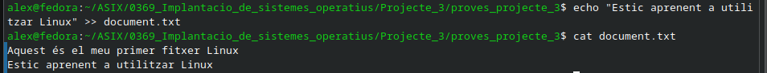

## **Activitat 6 – Copiar un fitxer**
Executa: ```cp document.txt copia.txt```  
La comanda cp serveix per copiar fitxers.  
Comprova-ho: ```ls```  
Ara tens dos fitxers.  
Consulta el contingut de la còpia: ```cat copia.txt```  

### **Respon:**
#### Quins dos fitxers tens ara?
- Tinc el fitxer de document.txt i el de copia.txt
#### Tenen el mateix contingut?
- Si, tenen exactament el mateix
#### Què fa la comanda cp?
- Demana al sistema que generi una copia del arxiu seleccionat amb el nom que tu tries, en auqest cas copia.txt **C**o**P**y

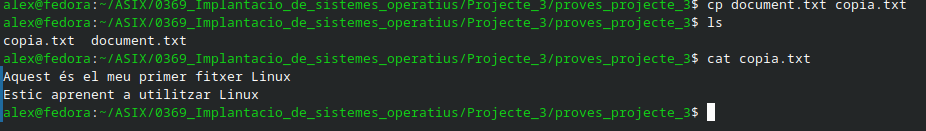

## **Activitat 7 – Crear una carpeta i moure un fitxer**
Crea una carpeta: ```mkdir documents```  
Ara mou copia.txt dins de la carpeta: ```mv copia.txt documents/```  
Comprova què tens: ```ls``` I després: ```ls documents```  

### **Respon:**

#### On es troba ara copia.txt?
- La copia.txt es troba a la carpeta documents
#### Quina funció té mv?
- ```mv``` te la funció de moure i renombrar arxius i directoris **M**o**V**e
#### Representa l'estructura

```Taula
/proves_projecte_3  
    └── document.txt
    └── documents
        └── copia.txt
```
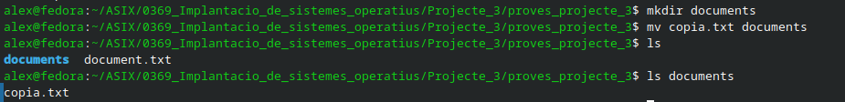

## **Activitat 8 – Canviar el nom d'un fitxer**

Ara canvia el nom de document.txt.
Executa: ```mv document.txt informe.txt```
Comprova: ```ls```

### **Respon:**
#### Quin era el nom original?
- documents
#### Quin és el nom actual?
- informe
#### S'ha creat una còpia del fitxer?
- No, al fer mv sense triar un nou directori el que fem es cambiar el nom del archiu, si volem fer una copia hem de fer cp
#### Què podem utilitzar mv per fer?
- Podem utilitzar mv per moure o renombrar arxius i directoris

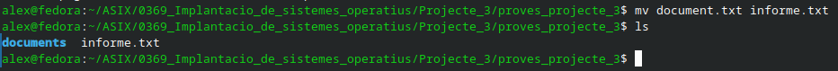

## **Activitat 9 – Eliminar un fitxer**
Ara elimina informe.txt.
Executa: ```rm informe.txt```
I comprova: ```ls``
La comanda rm serveix per eliminar fitxers.

*⚠️ Important:*
*La comanda ```rm``` s'ha d'utilitzar amb molta precaució. Abans d'eliminar alguna cosa, has de comprovar que és realment el fitxer que vols eliminar.*

### **Respon:**

#### Què ha passat amb informe.txt?
- Que l'hem eliminat utilitzan la comanda ```rm``` **R**e**M**ove

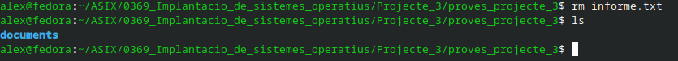

## **Activitat 10 – La jerarquia de directoris**
Ara veurem una part important de Linux.

Executa: ```cd /``` Després: ```pwd```

El resultat hauria de ser: ``/``

Ara: ```ls```

Observa els directoris que apareixen.
Entre d'altres, pots trobar:
>home  
>etc  
>tmp  
>usr  
>var  
>dev  

No cal memoritzar-los tots.
### **Investiga**
Consulta el contingut de: ```ls /home```
I després: ```ls /tmp```

### **Respon:**
#### Què és /?
- ```/``` es el directori base de Linux
#### Què és /home?
- ```/home``` es el directori principal de linux on s'emmagatzeman els usuaris
#### Quina diferència observes entre /home i /tmp?
- ```/home``` només te el directori de alex i ```/tmp``` te molts mes directoris, que son directoris temporals

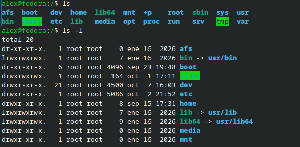
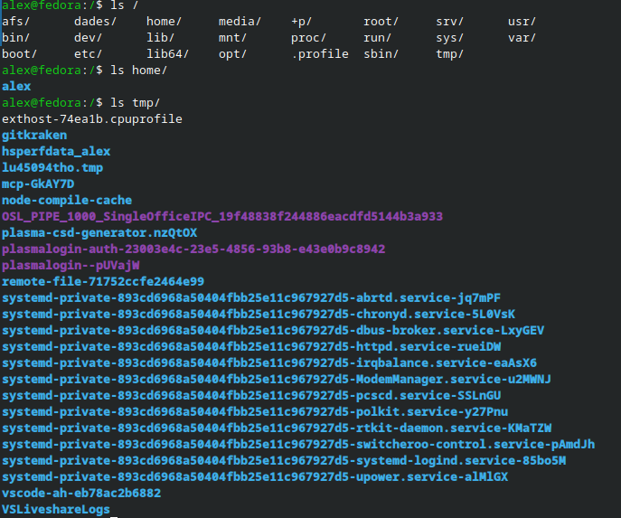

## **Activitat 11 – Tornem al nostre directori**
Executa: ```cd ~```
I després: ```pwd```
El símbol ~ representa el directori personal de l'usuari.
### **Respon:**

#### Quina diferència hi ha entre cd / i cd ~?
- Que ```cd /``` ens porta al directori absolut i ```cd ~``` ens porta al directori principal de l'usuari

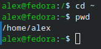

## **Activitat 12 – Els permisos**

Torna al directori del projecte: ```cd ~/prova_projecte_3```
Crea un fitxer: ```touch permisos.txt```
Ara executa: ```ls -l permisos.txt```
Al principi de la línia apareixeran unes lletres semblants a: ```-rw-r--r--```
En aquesta activitat només ens fixarem en tres lletres:
**r = lectura**
**w = escriptura**
**x = execució**

### **Respon:**
#### Quina lletra representa la lectura?
- la lectura es representa amb la R de read
#### Quina representa l'escriptura?
- L'escriptura la representem amb la W de write
#### Quina representa l'execució?
- L'execució la representem amb la X de eXecute
#### Quines lletres apareixen als permisos del teu fitxer?
- -rw-r--r--

Fes una captura de:
ls -l permisos.txt
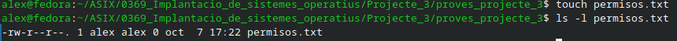

## **Activitat 13 – Els dispositius**
Linux també representa els dispositius de l'ordinador dins del sistema de fitxers.
Executa: ```ls /dev```

Apareixeran molts elements.

No cal que els memoritzis.

L'objectiu és entendre que Linux també gestiona els dispositius mitjançant el sistema operatiu.

Si tens disponible la comanda lsusb, executa: ```lsusb```

Aquesta comanda mostra dispositius USB detectats per l'ordinador.

### **Respon:**
#### Quins dispositius USB detecta el teu ordinador?
- Detecta 10 dispositus
#### Per què creus que és necessari que el sistema operatiu gestioni aquests dispositius?
- Per poder identificar que es cada dispositiu i donarli acces als drivers necesaris per el seu correcte funcionament

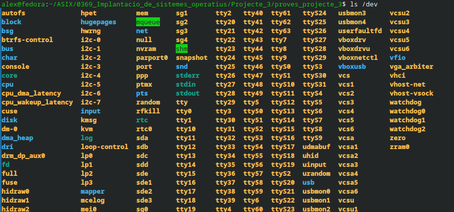
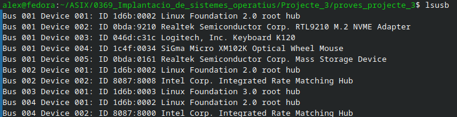

## **Activitat 14 – Què és l'E/S?**
Les sigles E/S volen dir Entrada/Sortida.

Un ordinador necessita comunicar-se constantment amb dispositius.

Exemples d'entrada
- teclat; 
- ratolí; 
- micròfon; 
- càmera. 

Exemples de sortida
- pantalla; 
- impressora; 
- altaveus. 

Alguns dispositius poden fer les dues coses.

Per exemple, un disc pot rebre informació quan hi guardem un fitxer i proporcionar informació quan el llegim.

### **Exercici:**

#### Completa la taula:
|Dispositiu|Entrada|Sortida|
|:---:|:---:|:---:|
|Teclat|[X]|[ ]|
|Ratolí|[X]|[ ]|
|Pantalla|[ ]|[X]|
|Impressora|[X]|[X]|
|Micròfon|[X]|[ ]|
|Altaveus|[ ]|[X]|
|Disc|[X]|[X]|

## **Activitat 15 – Un exemple d'E/S**

Pensa què passa quan fas aquesta acció:

Obres un fitxer que està guardat al disc.

### **Completa l'esquema:**


#### Explica breument què passa en cada pas.
- El disc li dona informació al sistema operatiu per un bus d'entrada i el SO fa apareixer a la pantalla el fitxer

## **Activitat 16 – Com gestiona l'ordinador les E/S?**
El sistema operatiu disposa de diferents mecanismes per gestionar les operacions d'entrada i sortida.

En aquest projecte coneixeràs tres conceptes: 

**E/S programada**

El sistema operatiu controla directament l'operació d'E/S.

**E/S per interrupcions**

El dispositiu avisa el processador quan necessita atenció.

**DMA**

Permet transferir dades entre un dispositiu i la memòria amb poca intervenció directa del processador.

### **Tasca**

#### Fes un petit esquema comparant els tres sistemes.

|E/S PROGRAMADA|E/S PER INTERRUPCIONS|DMA|
|:---:|:---:|:---:|
||||

*No cal explicar-los amb molt detall. L'objectiu és saber què són i distingir-los.*

## **Activitat 17 – Repàs de comandes**

### **Completa la taula amb les teves paraules.**

|Comanda|Per a què serveix?|
|:---:|:---:|
|**```pwd```**|Et mostra el directori al que et trobes, print working directory|
|**```ls```**|Fa una llista dels directoris i archius emmagatzemats al directori on et trobes, list|
|**```cd```**|Et mou al directori que demanis segons la ruta introduida, change directory|
|**```mkdir```**|Crea un nou directori al directori on li demanis(si no introdueixes directori la fa on et trobes), make directory|
|**```touch```**|Crea archius nous amb el nom i extensio que li demanis|
|**```cat```**|S'utilitza per llegir els continguts del fitxer indicat|
|**```cp```**|Crea una copia de l'arxiu o directori que indiquis, copy|
|**```mv```**|Mou o cambia el nom del arxiu o directori indicat, move|
|**```rm```**|Elimina el directori o arxiu que li indiquis, remove|
|**```ls -l```**|Fa una llista molt mes detallada amb informació extra dels arxius i directoris que estan dins del directori que li indiquis|

*Important: no copiïs les definicions del professor o d'Internet. Escriu-les com les explicaries a un company.*

## **Activitat final – La meva carpeta Linux**

Ara hauràs de demostrar que has après les operacions bàsiques.

### **Crea aquesta estructura:**

```Taula
/projecte_final  
    └── fitxer1.txt
    └── fitxer2.xtx
        └── documents
            └── document1.txt
            └── document2.txt
```
Els fitxers han de contenir text escrit per tu.

Has de ser capaç de fer-ho utilitzant les comandes que has après durant el projecte.

Quan acabis

#### Executa:

```ls``` i ```ls documents```

Fes captures de pantalla que permetin comprovar l'estructura.

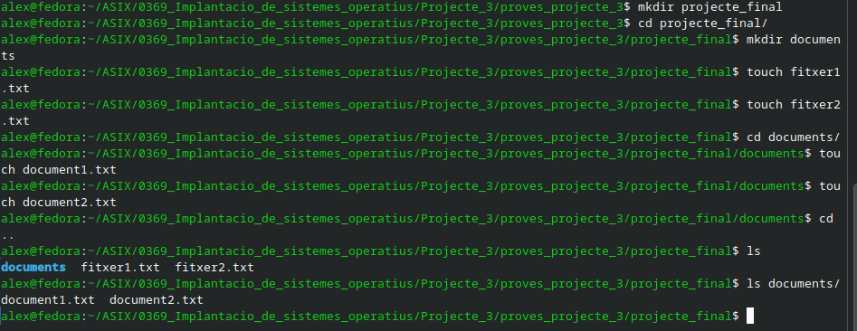
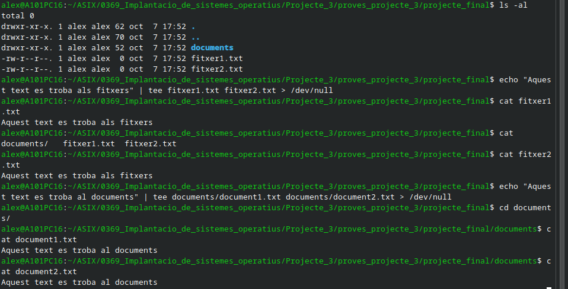

## **Conclusions**

### **Respon amb les teves paraules:**
#### Què és un fitxer?
- Es una colecció de dades emmagatzemades en una unitat basica d'info
#### Què és un directori?
- Un directori es una carpeta, on es poden emmagatzemar diferents directoris i fitxers
#### Quina diferència hi ha entre copiar i moure un fitxer?
- Al copiar es deixa el fitxer al directori original i al nou, i al moure es cambia el directori de un directori a un altre
#### Per a què serveixen els permisos?
- Per poder donar capacitats de lectura/escritura/execució a l'usuari propetari, al grup del propetari i a tothom
#### Què significa E/S?
- Entrada Sortida
#### Escriu tres comandes que ara saps utilitzar i explica per a què serveixen.
- Comanda 1: ```cd``` per cambiar de directoris

- Comanda 2: ```ls -al``` per fer una llista de quins fitxers i arxius es troben, ocults i no ocults al directori

- Comanda 3: ```rm``` per eliminar un arxiu o directori

#### Quina comanda t'ha resultat més fàcil?
- La comanda que més fàcil m'ha resultat es la comanda de ```cd``` ja que es una comanda que estaba molt familiaritzat
#### Quina t'ha costat més?
- Realment coneixia totes les comandes ja peró ```rm``` segueix sent una comanda que costa o dona por ja que si la executes de manera incorrecta pots fer un error molt greu

