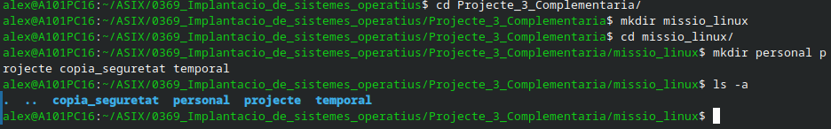
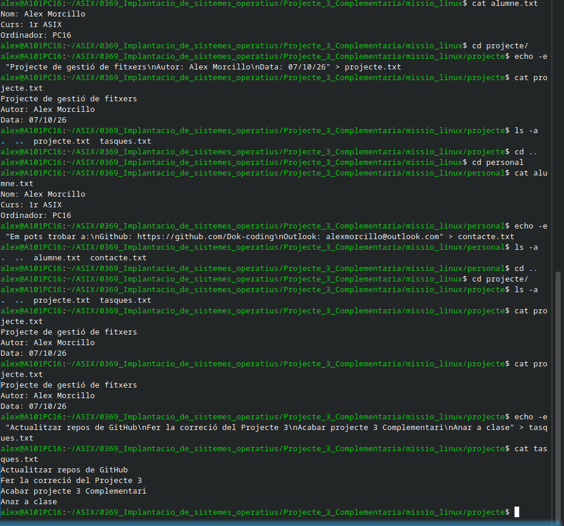

<!-- Aquest codi es necesari només per pasar el markdown a pdf amb les pautes demanades a l'activitat -->

<style>
@page {
  margin: 2.5cm;
  @bottom-right {
    content: counter(page);
    font-size: 10pt;
    font-family: sans-serif;
  }
}

body {
  font-family: Arial, Helvetica, sans-serif;
  font-size: 11pt;
  line-height: 1.5;
}

code {
  color: rgb(234, 128, 0);
  background-color: rgb(40, 40, 40);
  padding: 2px 4px;
  border-radius: 3px;
}

.resposta {
  color: #1a5276;
  font-weight: bold;
}

.portada {
  text-align: center;
  padding-top: 50px;
}

.portada h1 {
  font-size: 24pt;
  margin-bottom: 20px;
}

.portada h2 {
  font-size: 16pt;
  color: #555;
  margin-bottom: 40px;
}

.portada .dades {
  font-size: 12pt;
  margin-top: 150px;
  text-align: left;
  border-left: 4px solid #ea8000;
  padding-left: 15px;
}

h2 {
  page-break-before: always;
}

.index-personalitzat {
  font-size: 14pt;
  line-height: 2;
}

.nota {
  font-size: 8pt;
  color: rgb(40, 40, 40);
}
</style>

<!-- PORTADA -->

<div class="portada">
  <h1>Projecte 3. ACTIVITAT COMPLEMENTÀRIA – MISSIÓ: ADMINISTRADOR LINUX
Gestió de fitxers i E/S en Linux</h1>
  <h3>Implantació de Sistemes Operatius (0369)</h3>

  <div class="dades">
    <p><strong>Cicle Formatiu:</strong> Administració de Sistemes Informàtics en Xarxa, perfil professional Ciberseguretat (ASIX)</p>
    <p><strong>Alumne:</strong> Alex Morcillo Quiñones</p>
    <p><strong>Data:</strong> Octubre 2026</p>
  </div>
</div>

<div style="page-break-after: always;"></div>

<!-- ÍNDEX -->

## **Índex** - **ASIX - 0369 - Implantació Sistemes Operatius – Projecte 3. ACTIVITAT COMPLEMENTÀRIA – MISSIÓ: ADMINISTRADOR LINUX - Gestió de fitxers i E/S en Linux - Alex Morcillo**

<div class="index-personalitzat">

- [ACTIVITAT 1 · Fotografia inicial del sistema](#activitat-1--fotografia-inicial-del-sistema)
- [ACTIVITAT 2 · Quins programes utilitzen la memòria?](#activitat-2--quins-programes-utilitzen-la-memòria)
- [ACTIVITAT 3 · Què passa quan obrim programes?](#activitat-3--què-passa-quan-obrim-programes)
- [ACTIVITAT 4 · Investiguem un procés](#activitat-4--investiguem-un-procés)
- [ACTIVITAT 5 · Paginació](#activitat-5--paginació)
- [ACTIVITAT 6 · Memòria virtual](#activitat-6--memòria-virtual)
- [ACTIVITAT 7 · Abans i després](#activitat-7--abans-i-després)
- [ACTIVITAT 8 · Particions, segmentació i paginació](#activitat-8--particions-segmentació-i-paginació)
- [ACTIVITAT 9 · Investigació final](#activitat-9--investigació-final)
- [Conclusions](#conclusions)

</div>

<div style="page-break-after: always;"></div>

<!-- Aquí comença la activitat -->

## **Situació**
**Temps aproximat: 2 hores**
Imagina que acabes d'entrar a treballar com a tècnic de sistemes.  
Un company t'ha deixat una carpeta amb informació desordenada i t'ha demanat que la preparis abans de lliurar-la a un altre usuari.  
No trobaràs les comandes que has d'utilitzar. Has de decidir quina comanda és adequada en cada situació a partir del que has après durant el projecte.  
**Important:** no es tracta només d'aconseguir el resultat final. Has de poder explicar què has fet i per què.  

## **1. Preparar l'entorn**
### **Crea una carpeta anomenada:**
>missio_linux
A dins hauràs de construir aquesta estructura:

```Taula
/missio_linux  
    └── personal
    └── projecte
    └── copia_seguretat
    └── temporal
```
Condicions
    • Has de fer-ho des del terminal.
    • No pots utilitzar un gestor gràfic de fitxers.
    • Has de demostrar amb captures que has creat l'estructura.
### *Respon:**

#### Quina comanda has utilitzat per crear la carpeta?
- Per crear tots els directoris he utilitzat la comanda de ```mkdir```
#### Quina comanda has utilitzat per entrar-hi?
- Per entrar he utilitzat ```cd missio_linux```
#### Com has comprovat que eres dins de missio_linux?
- Amb cap comanda ja que a l'esquerra apareix la ruta en la que ets, peró pots fer la comanda ```pwd```



## **2. Crear la informació**
Dins de personal, crea:  
>alumne.txt  
>contacte.txt

Dins de projecte, crea:  
>projecte.txt  
>tasques.txt  

Els fitxers no poden quedar buits. 

El fitxer alumne.txt ha de contenir:
>Nom:  
>Curs:  
>Ordinador:  
*El valor d'Ordinador ha de correspondre a l'ordinador on estàs treballant.*

El fitxer projecte.txt ha de contenir:  
>Projecte de gestió de fitxers  
>Autor: [el teu nom]  
>Data: [data d'avui]  

El fitxer tasques.txt ha de tenir com a mínim quatre línies escrites per tu.  

## **Respon**

#### Quina comanda has utilitzat per crear els fitxers?
- Per crear els fitxers de text he utilitzat ```touch```
#### Quina comanda has utilitzat per escriure informació?
- Per escriure als diferents arxius he utilitzat ```echo -e```
#### Quina comanda has utilitzat per consultar el contingut?
- Per consultar que està tot bé he utilitzat ```cat```
#### Fes una captura que permeti comprovar els continguts dels quatre fitxers.
- 

## **3. Un error intencionat**

Afegeix al fitxer tasques.txt la línia:
>Tasques pendents de revisar

Comprova el contingut del fitxer.

### **Respon abans de continuar**

#### Què creus que passaria si utilitzessis > en lloc de >>?
- 
A continuació, crea una còpia de tasques.txt anomenada:   
>prova.txt

A prova.txt, fes una prova utilitzant >.   
Comprova el resultat i compara els dos fitxers.   

### **Respon:**
#### Què ha passat?
- 
#### Quina diferència hi ha entre > i >>?
- 
#### Quina de les dues utilitzaries per afegir informació al final d'un fitxer? Per què?
- 
Fes una captura que permeti comprovar el resultat.

<div class="nota">

*Ús de la IA(Gemini): En aquesta activitat he utilitzat la IA  per corregir errors ortogràfics, i d'estructura del markdown, juntament amb el corrector de [Softcatalà](https://www.softcatala.org/corrector/) per a la conclusió final, li he passat l'arxiu .md (markdown) sense les preguntes i li he demanat que em digui totes les faltes d'ortografia.*

</div>