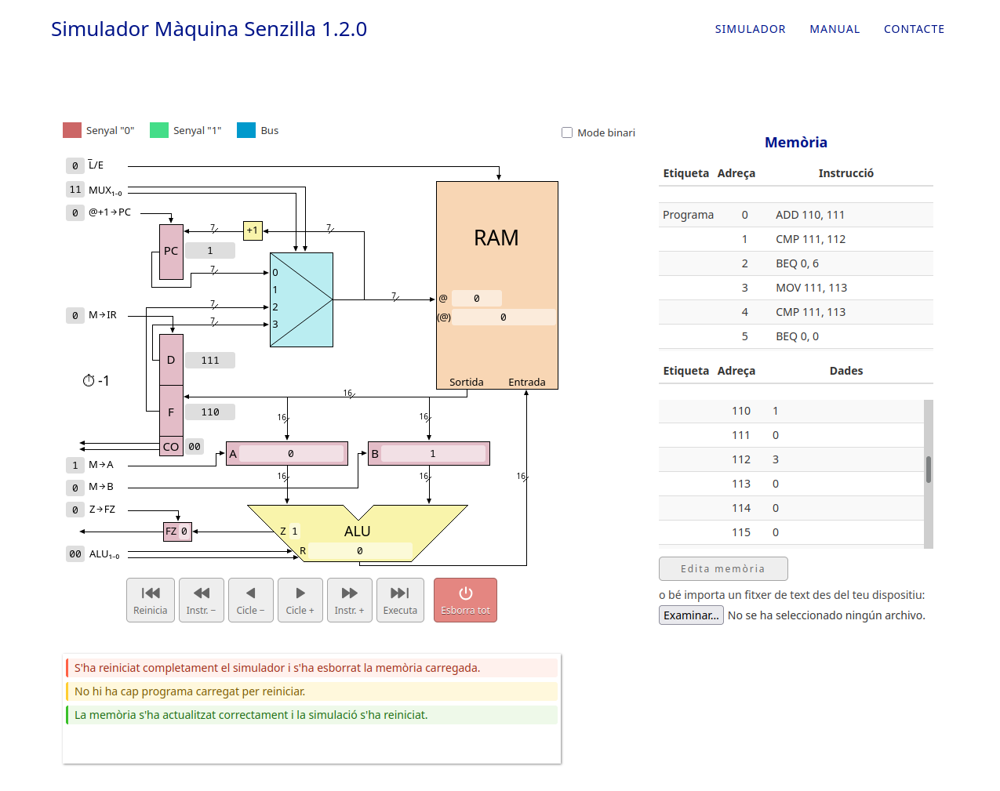
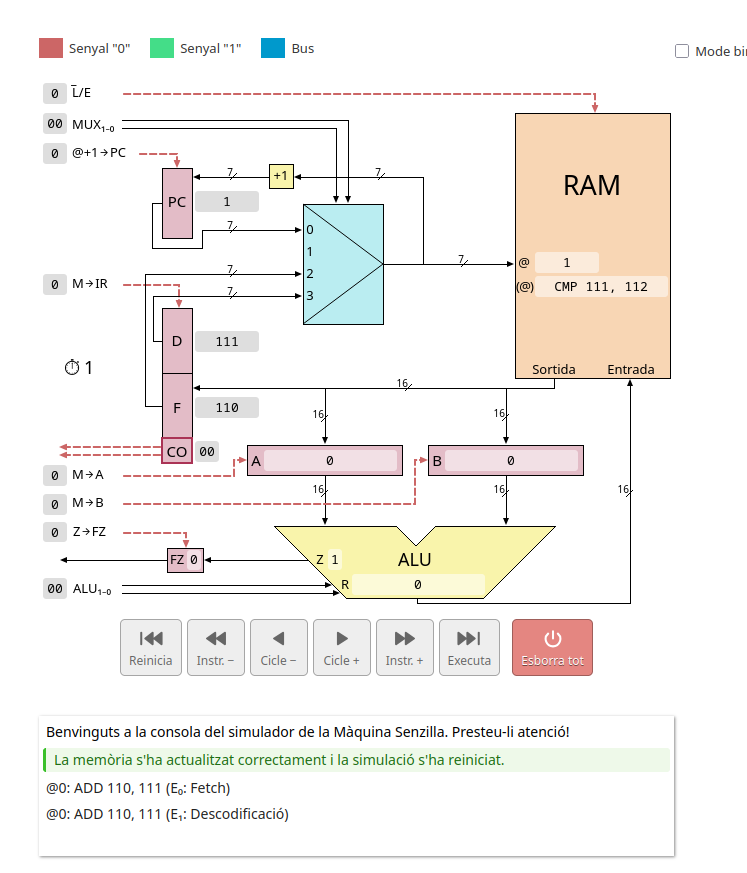
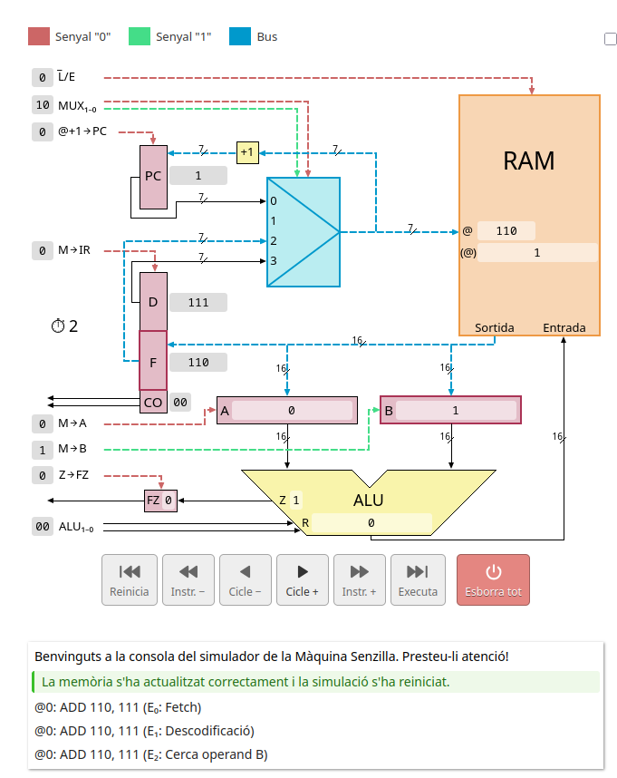
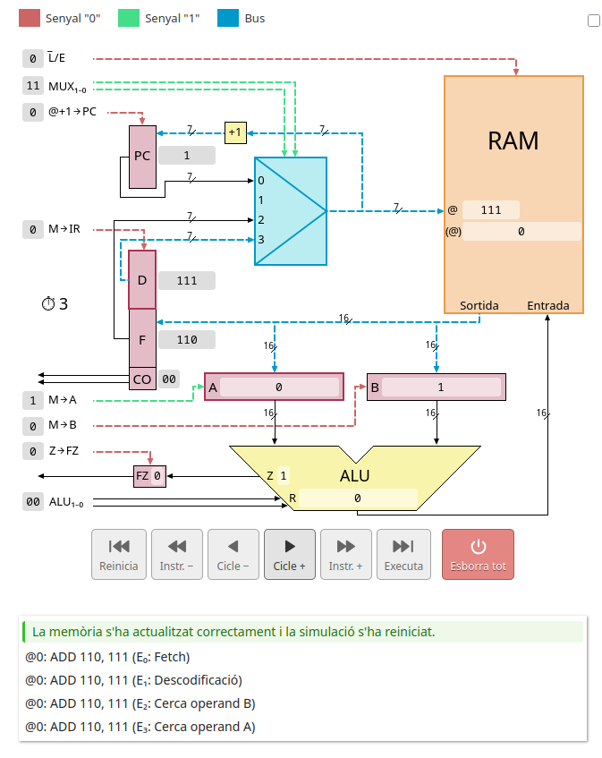
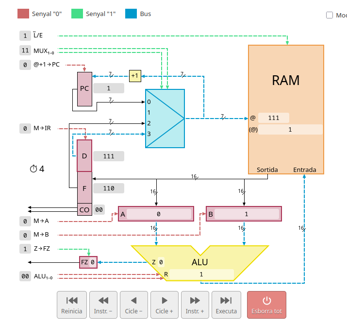
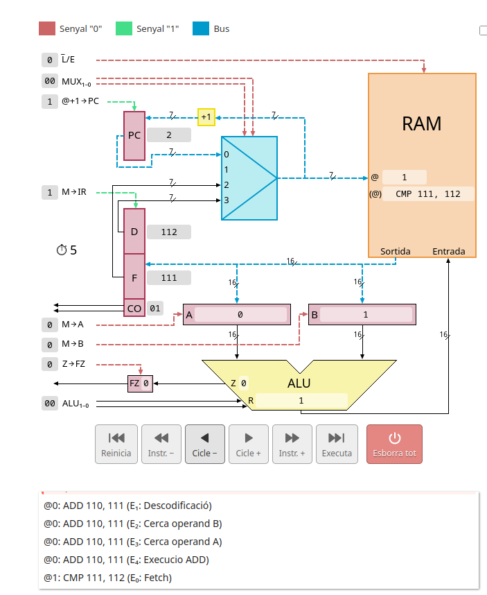
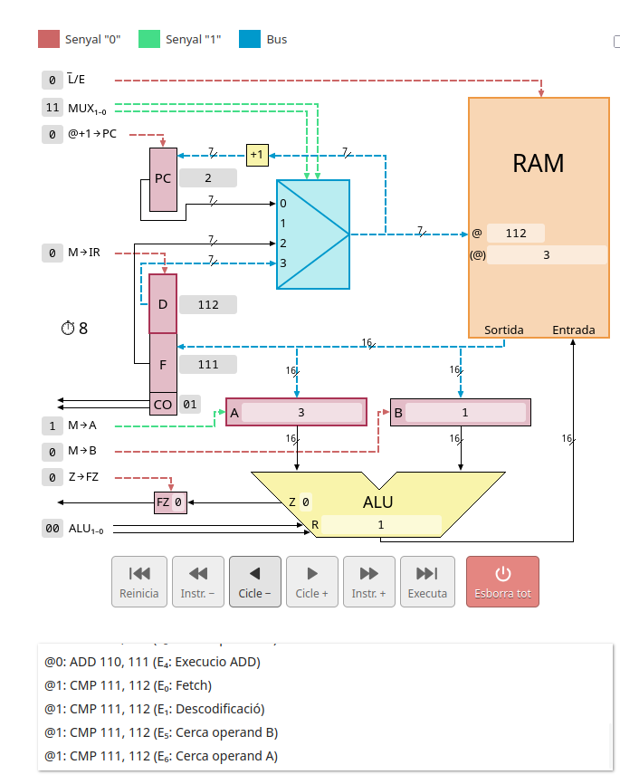
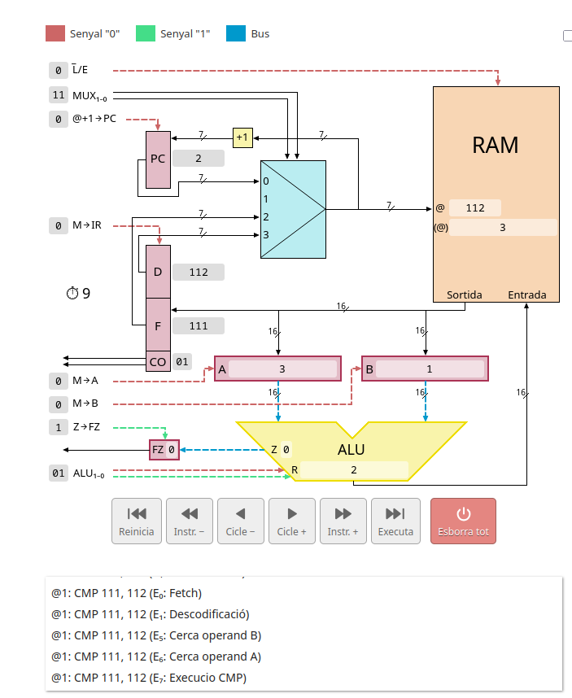
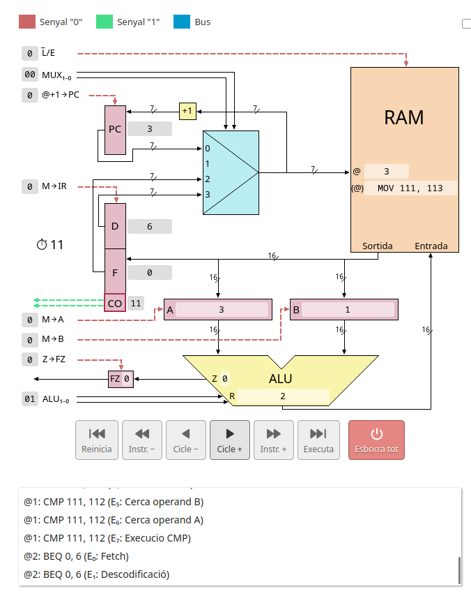
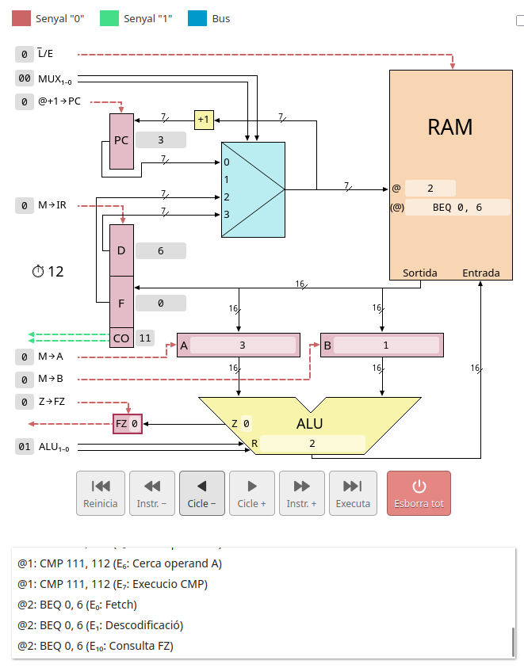

<!-- Aquest codi es necesari només per pasar el markdown a pdf amb les pautes demanades a l'activitat -->

<!-- PORTADA -->

  <h1>Activitat 1 - La màquina senzilla</h1>
  <h3>0371 - Fonaments de maquinari</h3>

  

    
<strong>Cicle Formatiu:</strong> Administració de Sistemes Informàtics en Xarxa, perfil professional Ciberseguretat (ASIX)

    
<strong>Alumne:</strong> Alex Morcillo Quiñones

    
<strong>Data:</strong> Octubre 2026

  

<!-- Aquí comença la activitat -->

# Activitat 1 - La màquina senzilla
Aquesta activitat es pot fer en parelles. Entregueu un sol .PDF responent a les següents qüestions.

## **1. Carregueu la següent informació al simulador de la UdG:**

Programa:
add 110, 111
cmp 111, 112
beq 6
mov 111, 113
cmp 111, 113
beq 0

Dades:
110: 1
111: 0
112: 3

### Emprant el simulador, **i només per les tres primeres Instruccions del programa**, detalleu a cada cicle de rellotge el què està passant a la simulació (habilitació de L/E, enviament de dades als busos, increment de comptadors, actualització de la memòria, etc.) i documenteu-ho fent captures de pantalla.

Instrucció 1: ADD 110, 111 - Suma adreça 110 amb la 111 i guarda el resultat a la 111 (Adreça destí)
- Cicle 0(Fetch): PC era 0, MUX = 00, L̅/E = 0 (RAM en mode lectura), RAM llegeix adreça 0 (ADD 110, 111), IR dona la instrucció de D = 111, F = 110, CO = 00, PC = 1 (PC 0+1)
- Cicle 1(Decode): Busos s'apaguen, PC = 1 i L̅/E = 0, al estar el PC en 1 i el MUX en 00 momentàniament la RAM agafa l'adreça 1
- Cicle 2(Cerca operand B): MUX = 10 (Ruta 2), RAM @ = 110 (Emmagatzema la info de la Font) (@) = 1 (el valor de @), B emmagatzema el valor F = 1
- Cicle 3(Cerca operand A): MUX = 11 (Ruta 3), RAM @ = 111 (Emmagatzema la info del Destí) (@) = 0 (el valor de @), A emmagatzema el valor D = 0
- Cicle 4(Execute) ALU rep ordre 00(ADD) i fa A(0)+B(1)=R(1), L̅/E = 1 (Escriptura), actualitza el valor (@) amb el resultat de R (@) = 1, Z -> FZ = 1 ho que transforma FZ en 0

Instrucció 2: CMP 111, 112 - Compara si 111 i 112 són iguals
- Cicle 5(Fetch): PC era 1, MUX = 00, L̅/E = 0 (RAM en mode lectura), RAM llegeix adreça 1 (CMP 111, 112), IR dona la instrucció de D = 112, F = 111, CO = 01, PC = 2 (PC 1+1)
- Cicle 6(Decode): Busos s'apaguen, PC = 2 i L̅/E = 0, CO = 01(Comparar)
- Cicle 7(Cerca operand B): MUX = 10 (Ruta 2), la RAM emmagatzema la font i el seu valor, RAM @ = 111 (@) = 1
- Cicle 8(Cerca operand A): MUX = 11 (Ruta 3), la RAM emmagatzema el destí i el seu valor, RAM @ = 112 (@) = 3
- Cicle 9(Execute) ALU rep ordre 01(CMP) i fa A(3)-B(1)=R(2), Z -> FZ = 1 la qual cosa transforma FZ en 0

Instrucció 3: BEQ 0, 6 - Si el pas anterior són iguals(FZ == 1) salta a l'adreça 6(finalitza l'operació)
- Cicle 10(Fetch): PC era 1, MUX = 00, L̅/E = 0 (RAM en mode lectura), RAM llegeix adreça 2 (BEQ 0, 6), IR dona la instrucció de D = 6, F = 0, CO = 11, PC = 3 (PC 2+1)
- Cicle 11(Decode): Busos s'apaguen, PC = 3 i L̅/E = 0, CO = 11(BEQ)
- Cicle 12(Consulta FZ): FZ = 0 per tant no són equals i passa a la instrucció 4

### Expliqueu a grans trets quin resultat s’està calculant i com.

- S'està calculant si el valor de 111 és igual al de 112, utilitzant 111 com acumulador, a cada pas estem sumant +1, que es el valor de 110 al c (111), després comparem si el comptador ha arribat al valor desitjat que tenim guardat a 112 (3 en aquest cas)  si és que sí, finalitzem el programa amb el BEQ 0, 6 si no fem una copia del valor a 113, i comparem, com sempre serà el valor igual tornem al principi del programa amb el BEQ 0, 0

### Què fa aquest programa?

- Aquest programa bàsicament fa la funció d'un comptador fins al valor que li demanem, si 112 és 40 conta fins a 40, si 112 és 10 contara fins a 10. Utilitza 110 com la variable de quants pasos volem fer, 111 com el comptador 112 com el límit i 113 com el reinici del programa si no ha arribat al número demanat

*Ús de la IA(Gemini): En aquesta activitat he utilitzat la IA únicament per corregir errors ortogràfics, i d'estructura del markdown, juntament amb el corrector de [Softcatalà](https://www.softcatala.org/corrector/) li he passat l'arxiu .md (markdown) i li he demanat que em digui totes les faltes d'ortografia.*

